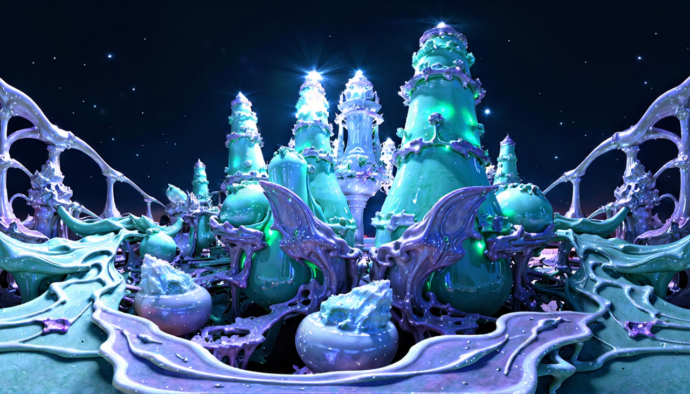
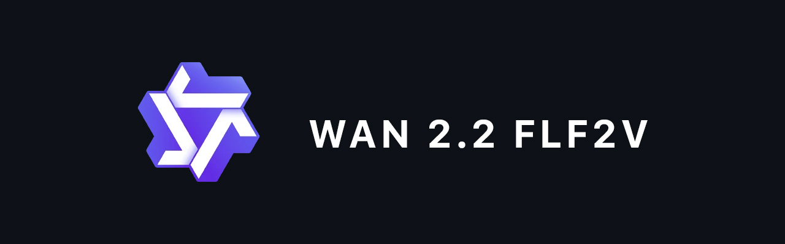
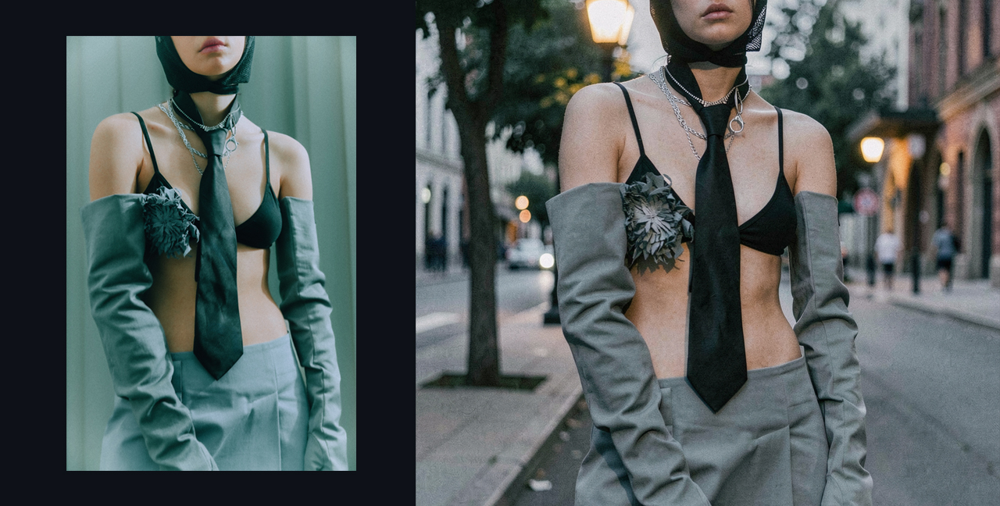
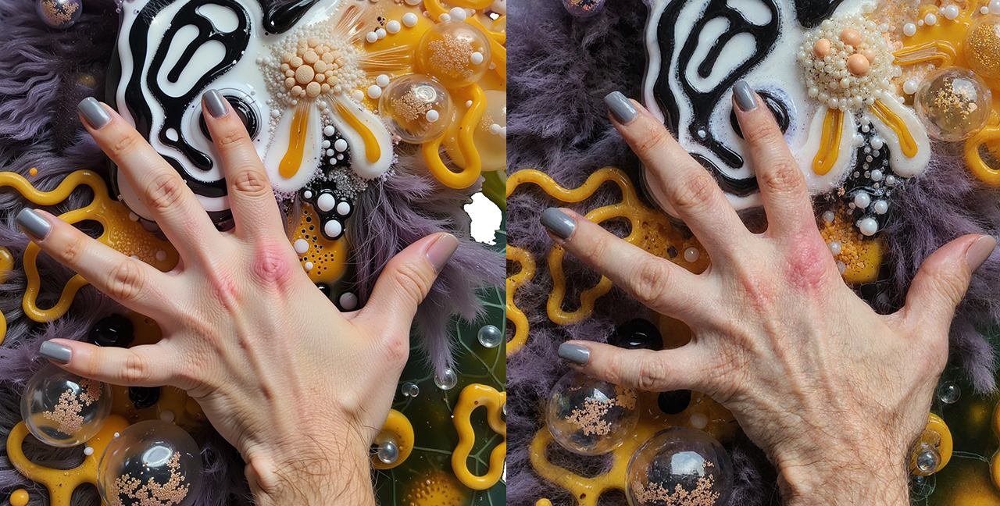
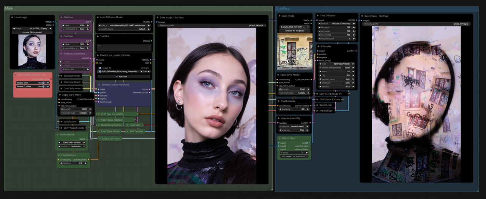

# ComfyUI Workflows

A collection of ComfyUI workflows I've built or adapted for my generative AI practice — spanning video synthesis, image editing, style transfer, and interactive installations.

---

## Workflows

### Generative World Creator
**`360° HDRI panorama generation for real-time installation`**

Built for the **Moscow-2030** generative installation (2025). Visitors typed a world description into a TouchDesigner touchscreen interface. The workflow converted text into a seamless 360° HDRI panorama, which TouchDesigner wrapped around a sphere on a large display. Over the course of the installation, ~10,000 images were generated.

**Pipeline**
1. `OpenRouterNode (Gemini 2.5 Flash)` — expands user text into a detailed scene description, rewrites unsafe prompts
2. `JWStringConcat` — prepends the `360 HDRI seamless photo. A panoramic view of...` prefix
3. `Flux Dev fp8 + LoRA 360HDR` — generates the panorama at 1344×768

**Custom Nodes**
- `OpenRouterNode` — LLM routing via OpenRouter API
- `JWStringConcat` — string assembly
- `DF_Text_Box` — multiline text input for the installation UI
- `LayerUtility: PurgeVRAM` — VRAM management for long batch sessions
- `ModelSamplingFlux` — Flux-specific sampling configuration

**Files:** [`workflow/01_360_world_gen_wf.json`](workflow/01_360_world_gen_wf.json)

---

### WAN 2.2 FLF2V Video Generation
**`First-Last Frame to Video with prompt expansion`**

Image-to-video workflow using **Wan 2.2 I2V 14B** (fp8) with the LightX2V speed LoRA. Takes a pair of images (first frame + last frame) and generates the interpolated video between them. Includes a Google Translate node for working with Russian-language prompts, and an LLM-based prompt expander for richer descriptions.

**Pipeline**
1. `UNETLoader` — loads `wan2.2_i2v_low_noise_14B_fp8_scaled`
2. Two `LoraLoaderModelOnly` — stacks the LightX2V high-noise and low-noise LoRAs
3. `PathchSageAttentionKJ` — applies SageAttention for faster inference
4. `GoogleTranslateTextNode` — translates RU → EN for the prompt
5. `JWStringConcat` — appends quality suffix (`4k`)
6. First + last frame input via `ImageResizeKJv2` — resizes both frames to target resolution (720×1280)
7. `CLIPLoader` (umt5_xxl fp8) + `VAELoader` (wan 2.1 vae) — text and latent encoding

**Models**
- `wan2.2_i2v_low_noise_14B_fp8_scaled.safetensors`
- `wan2.2_i2v_lightx2v_4steps_lora_v1_high_noise.safetensors`
- `wan2.2_i2v_lightx2v_4steps_lora_v1_low_noise.safetensors`
- `umt5_xxl_fp8_e4m3fn_scaled.safetensors`
- `wan_2.1_vae.safetensors`

**Custom Nodes**
- `comfyui-kjnodes` — ImageResizeKJv2, PathchSageAttentionKJ
- `comfyui_custom_nodes_alekpet` — GoogleTranslateTextNode
- `comfyui-various` — JWStringConcat
- `comfyui_fill-nodes` — FL_ImageBatchToGrid

**Files:** [`workflow/02_WAN22_FLF2V_wf.json`](workflow/02_WAN22_FLF2V_wf.json)

---

### Flux Klein 9B Batch Image Editing
**`Batch image editing with two reference injection streams`**

Image editing workflow built around **Flux 2 Klein 9B** — a compact but capable model with a Qwen 3 8B text encoder. Uses two `FL_ImageRandomizer` nodes to inject random images from two separate folders (local content + style references) into the conditioning pipeline simultaneously. Supports batch processing with `ClownsharKSampler_Beta` using fully implicit Gauss–Legendre solvers.

**Pipeline**
1. `UNETLoader` — loads `flux-2-klein-9b`
2. `CLIPLoader (qwen_3_8b fp8)` + `VAELoader (flux2-vae)` — model stack
3. Two `FL_ImageRandomizer` — independently randomizes images from two input folders
4. `LoadImage` — fixed reference or mask image
5. Inpainting conditioning node — merges positive/negative + image + VAE
6. `TorchCompileModel` (cudagraphs, disabled by default) — optional speedup
7. `Flux2Scheduler` + `ClownsharKSampler_Beta` — sampling with beta scheduler and implicit solver

**Models**
- `flux-2-klein-9b.safetensors`
- `qwen_3_8b.safetensors`
- `flux2-vae.safetensors`

**Custom Nodes**
- `RES4LYF` — ClownsharKSampler_Beta (advanced sampler)
- `comfyui_fill-nodes` — FL_ImageRandomizer (batch image randomizer)
- `comfy-core` — Flux2Scheduler, TorchCompileModel

**Files:** [`workflow/03_Flux_Klein_9b_batch_wf.json`](workflow/03_Flux_Klein_9b_batch_wf.json)

---

### Flux Unsampling + Style Transfer
**`Image editing guided by Redux style reference + LoRA`**

Style-guided image editing via **BNK Unsampler** — the source image is unsampled (noise is re-injected) and then resampled using a Redux style conditioning as a directional reference. Uses `LatentInterpolate` at multiple stages to blend between the original latent and the Redux-guided result, allowing fine control over how much the style influences the output. LoRA stacking adds further style specificity.

**Pipeline**
1. `Flux Dev` model + CLIP T5 encoder + `ModelSamplingFlux`
2. `Flux Redux` — encodes reference image as style conditioning
3. `BNK_Unsampler` — encodes source image back into noise space
4. `Latent Upscale by Factor (WAS)` — mild upscale on the latent (1.05×)
5. First `LatentInterpolate` — blends original latent with unsampled latent (ratio: 0.3)
6. First `SamplerCustomAdvanced` — sampling pass guided by mixed latent
7. Second `LatentInterpolate` — second blend for additional style control
8. Second `SamplerCustomAdvanced` — refinement pass
9. Three `BasicScheduler` stages (33, 44, 44 steps at denoise 1.0 / 0.5 / 0.5)

**Custom Nodes**
- `ComfyUI_Noise` — BNK_Unsampler
- `was-node-suite-comfyui` — Latent Upscale by Factor

**Files:** [`workflow/04_Flux_unsampling_wf.json`](workflow/04_Flux_unsampling_wf.json)

---

### Flux Redux + Hires Fix
**`Dual Redux style pass with tiled upscaling`**

Two-pass Redux workflow with a full **hires fix** stage using `TiledDiffusion` (Mixture of Diffusers). The first pass generates an image at base resolution guided by two Redux conditioning inputs. The second pass upscales and refines tiles at high resolution, allowing output up to 1920px+ without VRAM overflow. Each Redux input is processed separately and merged via `FluxReduxImageEncoder`.

**Pipeline**

*Pass 1 — Base generation*
1. `UNETLoader` — loads Flux Dev (stoiqo variant)
2. `StyleModelLoader` — `flux1-redux-dev.safetensors`
3. `VAELoader` — `ae.sft`
4. `ModelSamplingFlux` — configures shift (1.15)
5. Two `FluxReduxImageEncoder` — encodes two separate reference images as style
6. `BasicGuider` + `KSamplerSelect (deis)` + `BasicScheduler (beta, 20 steps)`
7. `SamplerCustomAdvanced` — first generation pass

*Pass 2 — Hires Fix*
1. `VAEEncode` — encodes first-pass image back to latent
2. Image upscale to target resolution (1088×1920)
3. `TiledDiffusion` — patches the model for 768×768 tile processing, 128 overlap, 8 batch
4. `KSampler (deis, beta, 20 steps, denoise 0.53)` — tile-aware refinement pass
5. `SaveImage` — saves final result

**Models**
- Flux Dev (stoiqo variant) — `stoiqoNewrealityF1D.nVMO.safetensors`
- `flux1-redux-dev.safetensors`
- `ae.sft` (Flux VAE)

**Custom Nodes**
- `ComfyUI-TiledDiffusion` — TiledDiffusion (Mixture of Diffusers)
- `comfy-core` — StyleModelLoader, FluxReduxImageEncoder, BasicGuider, SamplerCustomAdvanced

**Files:** [`workflow/05_FluxReduxHires_wf.json`](workflow/05_FluxReduxHires_wf.json)

---

## About

These workflows are part of my generative AI practice. Some were built from scratch for specific projects, others were adapted and extended from existing approaches. All have been tested in production on my own work.

**[alekseyefremov.com](https://alekseyefremov.com/)** · [Instagram](https://www.instagram.com/solar.w/) · [Telegram](https://t.me/slrwnd)
